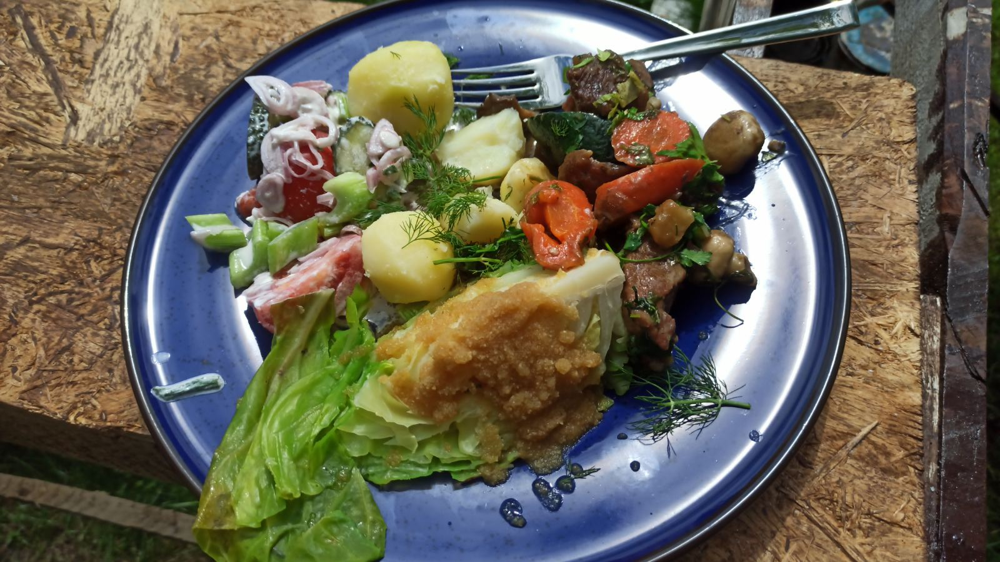

# Инструкция для работы с Markdown

## Выделение текста

Чтобы выделитьтекст курсивом необходимо обрамить его звёздочками (*) или знаком нижнего подчёркивания (_). Например, *вот так* или _вот так_.

Чтобы выделить текст полужирным необходимо обрамить его двойными звёздочками (**) или двойным знаком нижнего подчёркивания (__). Например, **вот так** или __вот так__.

Альтернативные способы выделения текста жирным или курсивом нужны для того, чтобы мы могли совмещать оба этих способа. Например,_текст может быть выделен курсивом и при этом быть **полужирным**_.
## Списки

Чтобы добавить ненумерованные списки, необходимо пункты выделить звёздочкой (*) или знаком +. Например, вот так:
* Элемент 1
* Элемент 2
* Элемент 3
+ Элемент 4

Чтобы добавить ненумерованные списки, необходимо пункты просто пронумеровать. Например, вот так:
1. Первый пункт
2. Второй пункт
## Работа с изображениями

Чтобы вставить изображение в текст, достаточно написать следующее:

## Ссылки

Ссылка предполагает, что у нас есть некий текст []  и сама ссылка в скобочках (). Например, вот так
[Google] (https://google.com)

## Работа с таблицами

## Цитаты

Цитаты обозначаются символом > 

 Его можно вставлять как перед каждой строкой цитаты, так и только перед первой строкой абзаца. Например, вот так:
 > Это пример цитаты,
 > в которой перед каждой строкой
 > ставится угловая скобка.

 > Это пример цитаты,
 в которой угловая скобка
 ставится только перед началом нового параграфа.
 
 > Второй параграф.

## Заключение
